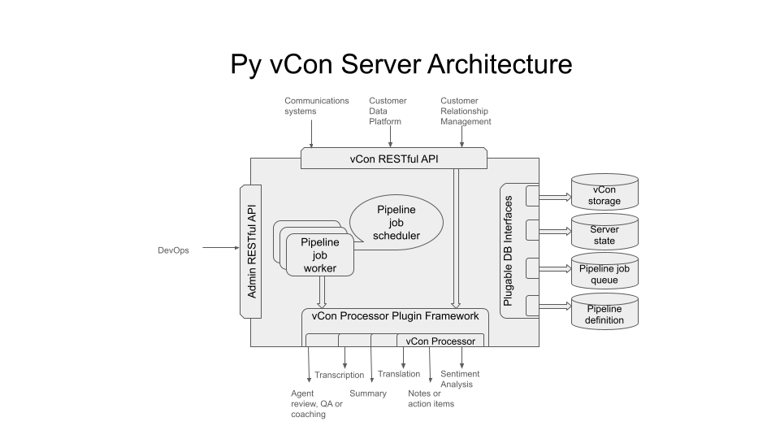

# The py_vcon_server Python Package

Please pardon the lack of content here.  We are still under construction.

The first release and documentation comming soon.

## Table of Contents

  + [Overveiw of vCon Server](#overview-of-vcon-server)
  + [Terms](#terms)
  + [Architecture](#architecture)
  + [RESTful API Documentation](#restful-api-documentation)
    + [Admin RESTful API](#admin-restful-api)
    + [vCon RESTful API](#vcon-restful-api)
  + [Pipeline Processing](#pipeline-processing)
  + [vCon Processor Plugins](#vcon-processor-plugins)
  + [Access Control](#access-control)
  + [Building](#building)
  + [Installing and configuring](#installing-and-configuring)
  + [Testing the vCon server](#testing-the-vcon-server)
  + [Extending the vCon Server](#extending-the-vcon-server)
  + [Support](#support)

## Overview of vCon Server
  * vCon RESTful API
  * vCon Pipeline Server
  * vCon Processor Plugin Framework
  * Admin RESTful API
  * Plugable DB Interfaces
    
## Terms
 * **vCon processor** - a **VconProcessor** is an abstract interface for plugins to process or perform operations on one or more vCons.  A **VconProcessor** takes a **ProcessorIO object and **ProcessorOptions** as input and returns a **VconProcessor** as output.  The **VconProcessor** contains or references the vCons for the input or output to the **VconProcessor**.
 * **pipeline** - a **VconPipeline** is an ordered set of operations or **VconProcessors** and their **ProcessorOptions** to be performed on the one or more vCons contained in a **ProcessorIO**.  The definitionof a **VconProcessor** (its **PipelineOptions** and the list of names of **VconProcessors** and their input **ProcessorOptions**) is saved using a unique name in the **PipelineDB.  A **ProcessorIO** is provided as input to the first **VconProcessor** in the **VconPipeline**, its output **ProcessorIO** is then passed as input to the next **VconProcessor** in the **VconPipeline**, continuing to the end of the list of **VconProcessors** in the **VconPipeline**.  A **VconPipeline** can be run either directly via the **vCon RESTful API** or in the **Pipeline Server**.
 * **pipeline server** - the pipeline server runs **VconPipeline**s in batch.  Jobs to be run through a **VconPipeline** are added to a **JobQueue** via the **vCon RESTful API**.  The pipeline server is configured with a set of queues to tend.   The pipeline server pulls jobs one at time from the **JobQueue**, retieves the definition for the **VconPipeline** for that **JobQueue** and assigns the job and **VconPipeline** to a pipeline worker (OS process) to run the pipeline and its processors and optionally commit the result in the **VconStorage** after successfully running all of the pipeline processors.
 * **queue job** - a queue job is the definition of a job to run in a **Pipeline Server**.  It is typlically a list of one or more references (vcon UUID) to vCon to be used as input to the begining of the set of **VconProcessors** in a **VconPipeline**.
 * job queue
 * server job queue
 * in progress jobs
 * pipeline worker
 * job scheduler
 * job - short for queue job
 * processor - short for vCon processor
 * queue - short for job queue
 * worker - short for pipeline worker

    
## Architecture

    Components
      vCon RESTful API built on FASTapi
      Admin RESTful API built on FASTapi
      Pipeline Server

      Pluggable DB Interfaces
        VconStorage
        ServerState
        JobQueue
        PipelineDB
        
        PipelineIO
        Pipeline
        
      Processor Plugin Framework
        vCon Processor
  
      Concepts
        vCon locking
        ACL

## RESTful API Documentation
[RESTful/Swagger docs](https://raw.githack.com/py-vcon/py-vcon/main/py_vcon_server/docs/swagger.html)

## Admin RESTful API

[Admin: Servers](https://raw.githack.com/py-vcon/py-vcon/main/py_vcon_server/docs/swagger.html#/Admin:%20Servers)

[Admin: Job Queues](https://raw.githack.com/py-vcon/py-vcon/main/py_vcon_server/docs/swagger.html#/Admin:%20Job%20Queues)

iterate entry points and gen doc from a template

## vCon RESTful API

iterate entry points and gen doc from a template

## Pipeline Processing

## vCon Processor Plugins

    link to plugins dir README.md

    template for generated docs
      TOC
      iterate through processors and grab doc
      gather all init_options types and processor options types

## Access Control
We realize Access Control is an important aspect of the vCon Server.  The ACL capabilities of the vCon Server has been planned out and desgined.  It will be implemented in the next release.

## Authentication and JWT

## Building

## Testing the vCon Server

A suite of pytest unit tests exist for the server in: [tests](tests)

Running and testing the server requires a running instance of Redis.
Be sure to create and edit your server/.env file to reflect your redis server address and port.
It can be generated like the following command line:

    cat <<EOF>.env
    #!/usr/bin/sh
    export DEEPGRAM_KEY=ccccccccccccc
    export OPENAI_API_KEY=bbbbbbbbbbbbb
    export HOSTNAME=http://0.0.0.0:8000
    export REDIS_URL=redis://172.17.0.4:6379
    EOF

The unit tests for the server can be run using the following command in this directory:

    source .env
    pytest -v -rP tests

## Installing and configuring
redis server docker

server in docker or from shell
## Extending the Vcon Server

## Support

